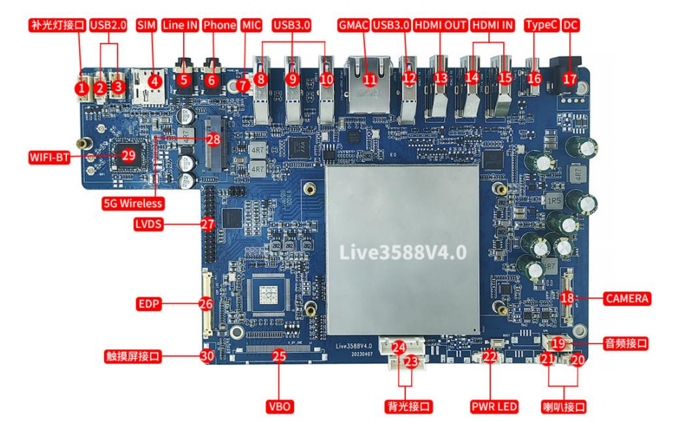

# 九鼎创展 Live3588v4.0 开发板


```
Something I hope you know before go into the coding~
First, please watch or star this repo, I'll be more happy if you follow me.
Bug report, questions and discussion are welcome, you can post an issue or pull a request.
```


## 相关站点

* 官网介绍页面: <http://www.9tripod.com/showpro.php?id=139>
* 官网论坛: <http://bbs.9tripod.com>
* 官网论坛: <http://x.9tripod.com>


## 开发板信息

- SOC RockChip RK3588
- CPU 4×Cortex-A76+4×Cortex-A55
- GPU ARM Mali-G610 MP4 四核 GPU
- NPU 6TOPS
- ISP 集成 48MP ISP with HDR&3DNR
- 内存 8GB/16GB 64bit LPDDR4/LPDDR4x
- 存储 128GB/256GB eMMC
- 硬件参数
- 以太网 1 × 千兆以太网
- 无线网络 2.4G/5G 双频 WIFI6
- 无线通讯 选配 5G 模块，即插即用
- 视频 1 × HDMI2.1（8K@60fps 或 4K@120fps）
- 1 × HDMI IN（4K@60fps)
- 1 × HDMI IN（1080P@60fps)
- 1 × LVDS（2K@60fps）
- 1 × EDP 显示输出（4K@60fps）
- 1 × VBO（4K@60fps，选配）
- 1 × CSI（最大 5000W MIPI 摄像头接口）
- 音频 2 × Speaker 喇叭输出
- 1 × Phone 输出
- 1 × HDMI 音频输出
- 1 × Line-In 输入
- 2 × MIC 输入
- 触摸 1 × I2C 输入（支持两种线序）
- 1 × USB 输入（4PIN PH 座）
- USB 4 × USB3.0
- 1 × TypeC
- 2 × USB2.0（由插针引出）
- 电源 DC12V 输入(DC5.0×2.5mm)
- 其他接口 带灯电源座
- 系统软件
- 系统 Android12.0
- 其他参数
- 尺寸 145mm×108mm
- 重量 约 125 克
- 散热 散热器安装孔距：75mm*47mm
- 功耗 待机功耗：约 1.08W (12V/90mA)
- 典型功耗：约 3.24W (12V/270mA)
- 最大功耗：约 9.72W (12V/810mA)
- 环境 工作温度：-10℃- 70℃





## 高透亚克力外壳


