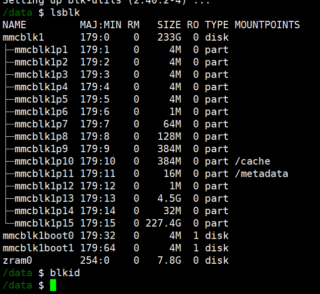
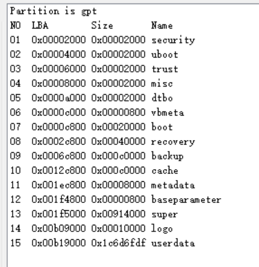

# 主板信息

分区名	起始地址 (sector)	大小 (sector)	实际大小	备注
security	0x00002000	0x00002000	4 MB	安全相关分区
uboot	0x00004000	0x00002000	4 MB	存放 U-Boot 镜像
trust	0x00006000	0x00002000	4 MB	TrustZone 相关镜像
misc	0x00008000	0x00002000	4 MB	系统状态标志（如 recovery 模式）
dtbo	0x0000A000	0x00002000	4 MB	设备树 overlay 分区
vbmeta	0x0000C000	0x00000800	1 MB	Android 验证启动元数据
boot	0x0000C800	0x00020000	64 MB	内核和 initramfs 镜像
recovery	0x0002C800	0x00040000	128 MB	恢复模式镜像
backup	0x0006C800	0x000C0000	384 MB	备份分区（预留）
cache	0x0012C800	0x000C0000	384 MB	缓存分区
metadata	0x001EC800	0x00008000	16 MB	系统元数据
baseparameter	0x001F4800	0x00000800	1 MB	基础参数配置
super	0x001F5000	0x00914000	2.32 GB (≈2372 MB)	Android 动态分区（包含 system/vendor 等）
logo	0x00B09000	0x00010000	32 MB	开机 logo 镜像
userdata	0x00B19000	-	剩余所有空间	用户数据分区（grow 表示动态扩展）
