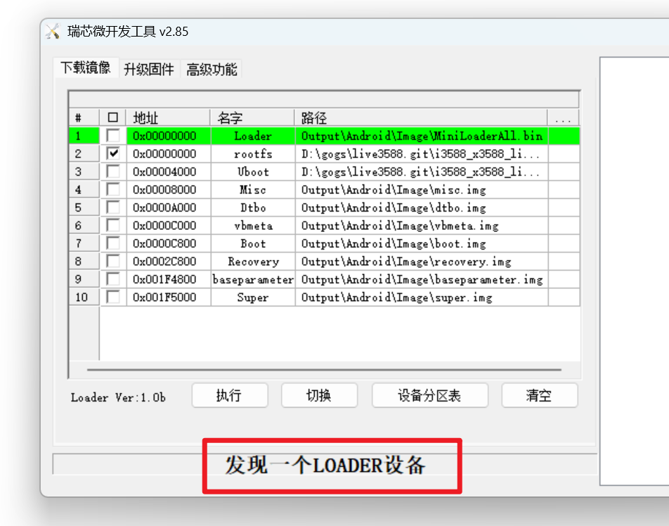

# 刷机指引

## 方式一：按maskrom按键进入maskrom模式


## 方式二：通过com串口线进入rockusb模式

1. uboot正常的情况下，uboot没有被破坏
2. 使用COM调试线连接开发板


按照图示连接TTL调试，注意VCC一定不要连接，只需要GND\TXD\RXD即可


* 若此时能够正常进入终端，执行重启命令，然后**立刻**按住CTRL+C不动
* 若无法进入终端，则上电的时候**立刻**按住CTRL+C不动


此时uboot启动被中断，可以执行uboot命令玩耍。如果要进入rockusb模式，则输入

```text
rockusb 0 mmc 0
```


数据线连接电脑和TYPEC口

电脑端开启瑞芯微官方的开发者工具，能够看到，发现一个LOADER设备。




