# 社区指引

## 官方固件

* <http://bbs.9tripod.com/forum.php?mod=viewthread&tid=119419&extra=page%3D1>

九鼎创展正式发布直播一体机15.6寸1080P、15.6寸4K屏、32寸1080P镜像，需要更新的朋友从这里获取镜像更新，后续此贴长期更新维护。

```
日期：2024.07.16最新固件(这里的固件是最新的，在这里的链接下载就行)
链接：https://pan.baidu.com/s/1lDKeaGZaZJnyYdBjvI6cyA?pwd=nhwa  提取码：nhwa      live15.6公版
链接：https://pan.baidu.com/s/1-FF1L8tj5z6h-B5m1G_PNA?pwd=ca9v  提取码：ca9v      15.6九影
链接：https://pan.baidu.com/s/1xc8wm_VeF1BlKvZaP3t00Q?pwd=gz9t  提取码：gz9t      32寸公版
链接：https://pan.baidu.com/s/1LzoTRklY-ssvNDSEsa5whA?pwd=uhok  提取码：uhok      15.6gms海外
链接: https://pan.baidu.com/s/1uZSg6v_1ndhLmAdnhaC69g?pwd=hyqt  提取码: hyqt      live10.1公版
链接: https://pan.baidu.com/s/1j7mFPAzllZ3oSy1XA_OUMA?pwd=ukfe  提取码: ukfe      10.1九影
链接：https://pan.baidu.com/s/1vsQE_mM9xLP-H417HaZbww?pwd=sde2  提取码：sde2       10.1gms海外
```


## 直播机升级固件教程

12V供电，type-c线连接直播机

### LOADER模式升级

安装驱动，否则找不到设备

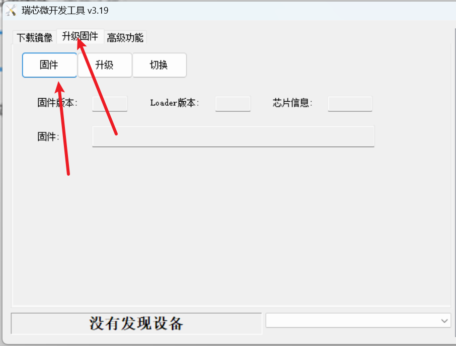

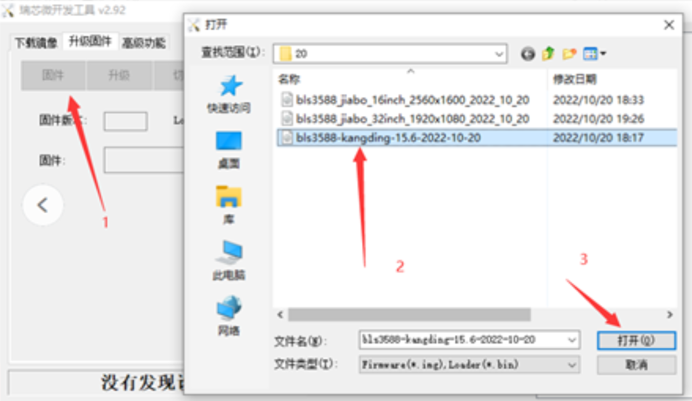

固件加载需要一点时间，加完后会在固件版本和固件位置显示固件的信息。

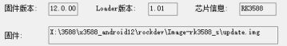


打开直播机的计算器输入  31333438= （点击=号进入LOADER模式升级）

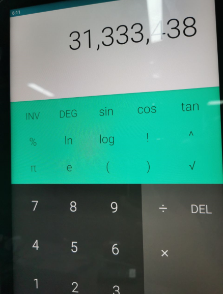

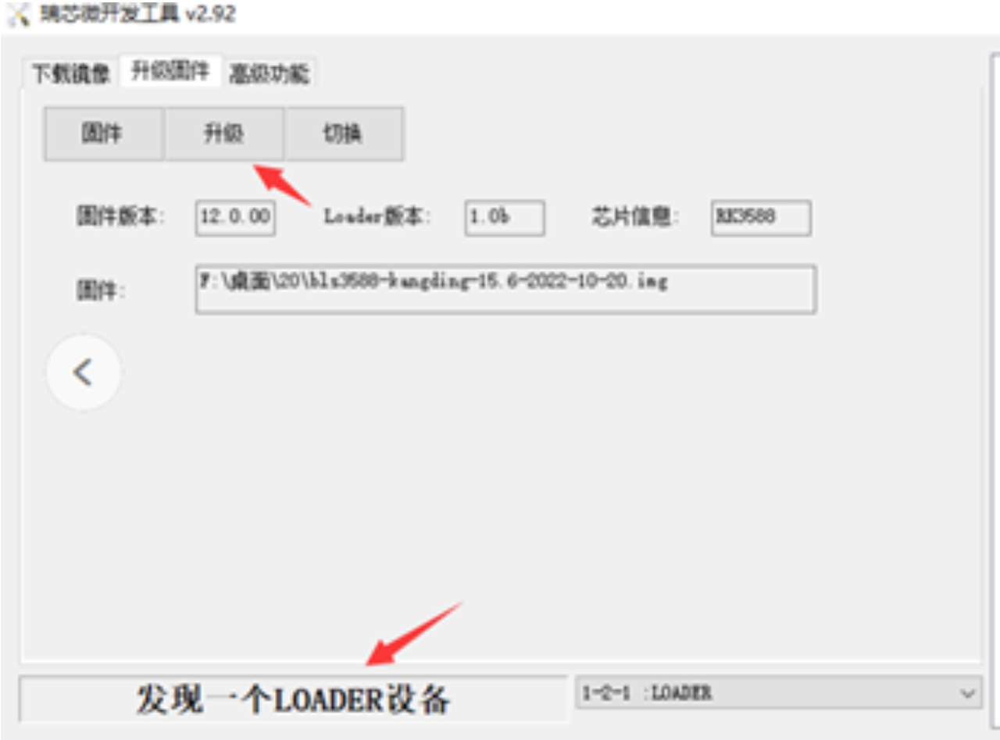

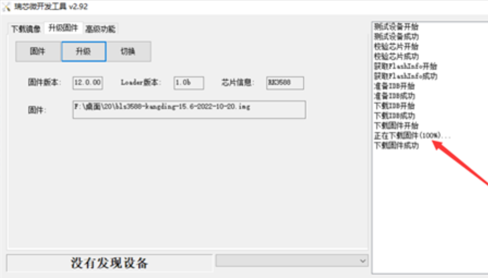


### maskrom模式升级


显示了信息以后，直接按开发板按键，上电后按住BOOT，按一下Reset。检测到Maskrom设备后松开BOOT，然后点击升级。（如果十几秒后还检测不到的话，松开BOOT重新重复刚才的按键步骤）

其他步骤类似

### U盘升级


将直播机供电开机，然后下载对应的发布镜像压缩包(后缀为.zip的就是U盘升级的压缩包）

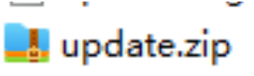

然后准备一个U盘，将文件系统选为FAT32格式，然后再格式化（如果你U盘本身就是FAT32格式的话那就不用格式化了，直接把update.zip文件放到U盘里就可以了

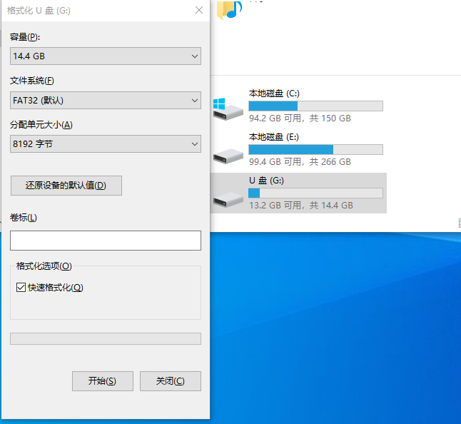

将固件压缩包放到格式化以后的U盘中，U盘里只放入对应的.zip压缩包文件就可以（下图中的那样）


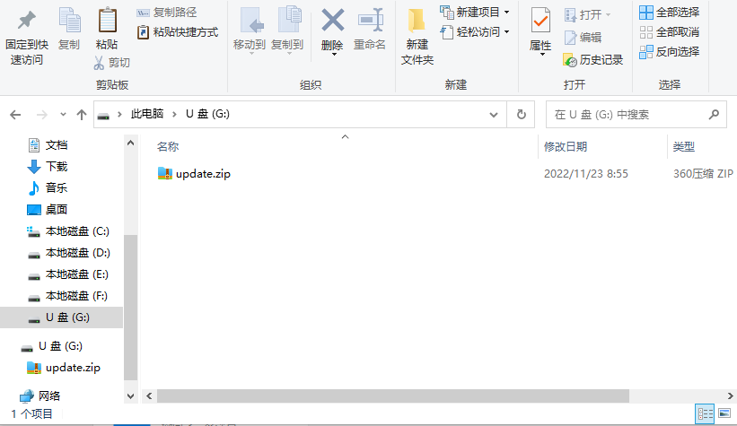

插入U盘之前先把直播机返回到主菜单界面。然后将U盘插入到直播机，几分钟后会弹出下面图片中的固件升级，选择安装

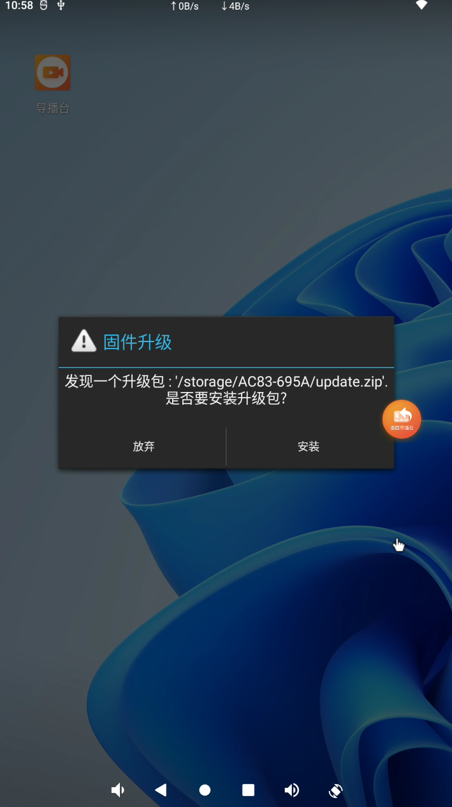

安装过程中只需要等待即可，千万不要断电，否则只能拆机用按键刷机（如果意外断电了只能用按键刷机的话，去按照直播机固件升级教程这个帖子中的最后面的按键刷机方法去刷机）

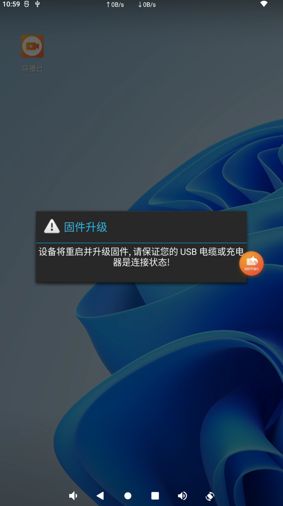

刷完以后因为U盘还插在直播机中所以过几分钟会再次弹出固件升级，这个时候选择放弃。
如果点错了又点了安装的话，那就会重新再升级一遍固件，这个时候只需要再重新等待直播机固件升级完后再弹出这个框的时候点击放弃即可，千万不要拔电源阻止。

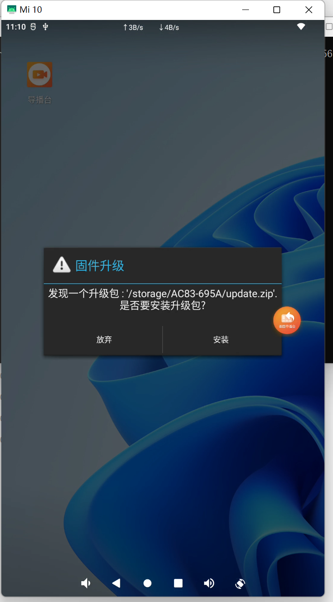

按上图点击了放弃以后，下拉通知栏将U盘弹出后拔出U盘就可以了

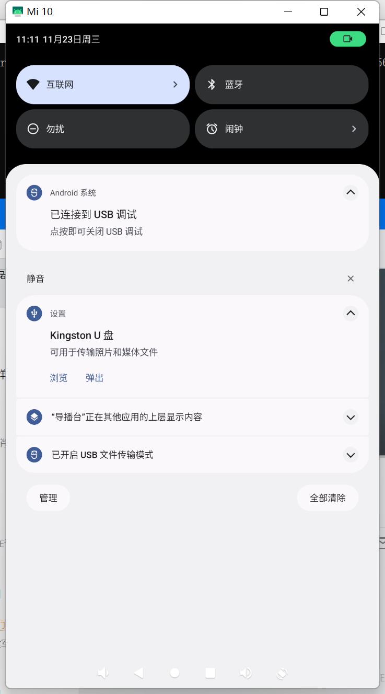


## 修改logo

其他的选项的地址的前面如果有勾的话都取消，然后点击设备分区表。等待读分区表成功。
然后再点击图片中红圈的位置，加载你要更改的开机logo

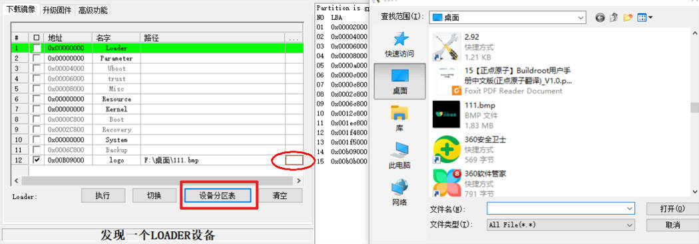

点击执行

下载成功

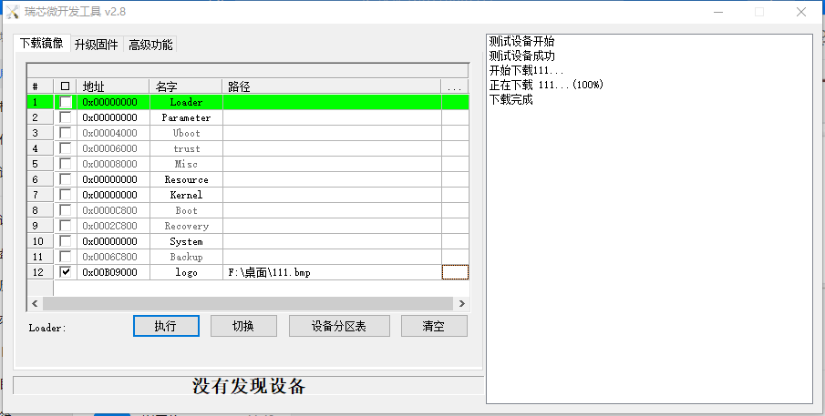


